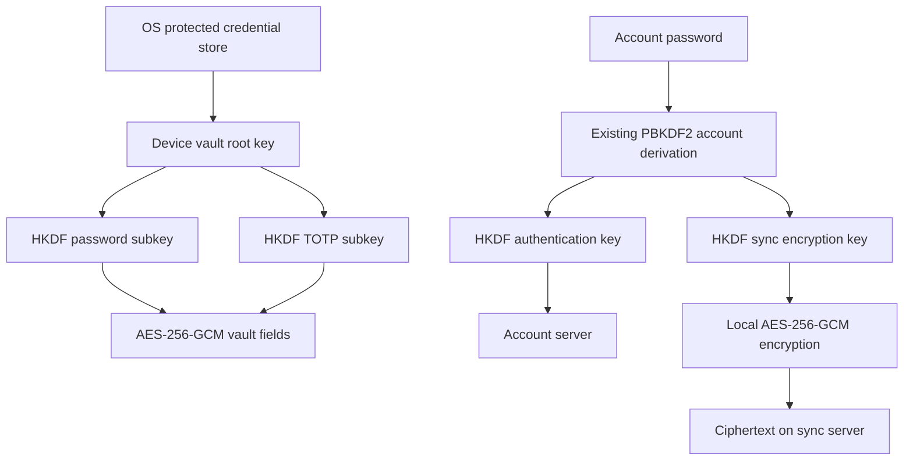

# Security architecture

Status: partial hardening, 2026-09-10. This is implementation documentation, not an independent audit or a claim that Luma is ready to hold high-value credentials.

## Trust boundaries

Luma's Flutter process, its compiled plugins, and the current OS user share a trust boundary. InheritedWidget scopes and private Dart fields are code organization, not a sandbox. A malicious plugin, native library, game process with the same user privileges, or compromised update may access private files or an unlocked process. OS secure storage improves offline file-copy resistance; it does not solve same-user malware.

## Cryptography and key hierarchy

`AuthenticatedCipher` uses the existing `cryptography` package's AES-256-GCM implementation. Binary envelopes are `LA | 01 | nonce(12) | ciphertext | tag(16)`. The header and caller context are authenticated as AAD. Keys must be 32 bytes. The library generates a fresh random nonce per encryption; tests exercise uniqueness but cannot prove absence of all future collisions.

Password fields have a `pw3:` textual prefix, AES-GCM envelopes, authenticated row/field identity, and separate HKDF-Expand labels for TOTP versus other vault fields. The root is a random device key. HKDF-Expand inputs are already random keys or existing KDF outputs, not passwords. Historical bound and unbound HMAC stream-cipher readers remain solely for compatibility. There is no new custom cipher.

Sync writes AES-GCM under an HKDF subkey labelled `luma-sync aes-gcm v2`. Legacy `LS1` blobs remain readable. The existing collection identity within snapshot plaintext remains checked by SyncService after authenticated decryption. Raw object APIs still need stronger object-name/version binding and replay protections.

Account derivation remains PBKDF2-HMAC-SHA256, normally 200,000 iterations, with existing salt semantics. Authentication and encryption keys have distinct HKDF labels. This has NOT been migrated to Argon2id or a random wrapped sync root. Server auth-key hashing remains the existing salted PBKDF2 implementation. Do not describe account KDF hardening as complete.

The optional app PIN now uses `cryptography` Argon2id with 19,456 KiB memory, two iterations, parallelism one, a random 16-byte salt and a 32-byte output. `argon2id-v1` selects these fixed parameters; unknown versions fail. Successful legacy SHA-256 PIN verification upgrades the stored verifier. This PIN is an action-level UI check, NOT a key-encryption key or repository lock. PIN changes no longer propagate through settings sync.

## Secure storage and migration

`SecureSecretStore` uses `flutter_secure_storage`: platform-protected Windows storage, Android keystore-backed storage, Apple Keychain and Linux Secret Service. Exact protection depends on OS configuration. Web storage is not equivalent to a hardware or OS key vault; web deployment is not validated here.

Migrated key domains: passwords, AI providers, SFTP saved credentials, GitHub credentials, YouTube credentials and AIS API credentials. Each retains its existing independent root key. The adapter validates length, refuses conflicting keys, writes and reads back the OS-stored value, and only then removes the legacy key file. Missing keys with existing encrypted data cause an error instead of key replacement. Some non-vault credential payloads still use their historical custom cipher: key storage migration does not change that fact.

Chat identity private/public material migrates from JSON to secure storage. Invalid identity material fails rather than generating a replacement identity. The chat message-cache format is unchanged and needs a separate at-rest review.

Sync token, encryption key, server origin, account email and KDF parameters are stored together in a protected credential bundle. The JSON file holds non-secret bookkeeping. Protected origin binding prevents editing the JSON URL to redirect the stored token. Saves are serialized per store. A corrupted persisted state is not silently discarded. This is not a general transactional database across OS storage and disk; interruption and platform recovery need device testing.

Vault ciphertext migration runs in a database transaction, decrypts both password and TOTP before writing, verifies replacement decryptions, and leaves unreadable rows intact. Sync rejects unreadable TOTP and missing password fields rather than exporting or importing empty substitutes. Import errors roll back the enclosing transaction.

## Vault and screen privacy

Passwords and TOTP fields are encrypted. Service names, email, username, phone, icon and info/secure notes are now packed into an authenticated `pwm1:` metadata envelope in the existing unbounded info column. Bounded service/email columns contain a fixed placeholder; optional metadata columns are null. Row IDs and timestamps remain visible. The repository and sync adapter unpack metadata after verification; modern password rows with missing metadata envelopes fail closed. Historical rows that cannot be safely decrypted remain untouched and may still contain plaintext metadata.

Other finance and notes databases remain plaintext. The repository still returns decrypted records, including seeds, to widgets; there is no master-password setup, repository-enforced lock, inactivity lock or guaranteed key erasure. Dart strings and garbage collection prevent a secure-erasure guarantee.

Vault copy actions expire the clipboard after 30 seconds if its text still matches. The timer retains a digest instead of the plaintext. The clipboard API cannot prevent OS clipboard history, synchronization, third-party readers or races with other processes. Screenshot restrictions are not implemented.

## Plugins and AI

Marketplace installation fetches metadata and enables compiled code. It does not establish an isolation boundary. There is no enforced capability broker or per-plugin OS sandbox. Do not treat manifest permissions or UI navigation as access control.

The assistant's current tool registry receives plugin-install and QR repositories; it has no password, TOTP, finance or notes query tool. This existing narrow injection is retained. Conversation text and tool results are sent to the selected provider, directly or through the configured server proxy. User-pasted secrets can still leave the device. There is no comprehensive data-consent broker or malicious-plugin containment. AI API key files use provider-bound AES-GCM for new writes with legacy reads.

## Sync, device trust and recovery

Snapshot/blob content is encrypted on the client; ordinary storage endpoints do not receive the encryption key. The server observes account identity, session/device labels, collection names, object sizes, times, versions, traffic patterns and public KDF parameters. Family/shared feature APIs and AI proxy content are not automatically covered by snapshot encryption. A malicious server may support offline guessing or substitute chat identity keys; strong global zero-knowledge claims are inappropriate.

Existing random, hashed, expiring server sessions and device revocation are retained. P2P trusts possession of the shared account-derived secret rather than a fully independent device enrollment identity. Revocation cannot retract keys/plaintext already copied to a device.

Before account password change/reset, the device retains the old sync key in an account/origin-scoped OS-protected history. Re-encryption now preserves opaque bytes, including cloud-file chunks, rather than treating all blobs as gzip JSON. Failures are surfaced. Reads can try this device's retained keys after current-key authentication fails, and still require valid authentication tags. History is intentionally retained for recovery; there is no user-facing history pruning/export or atomic cross-device rotation protocol yet. Other devices may remain unable to read a partial rotation. New writes must not be marketed as fully solved recovery.

There is no universal developer recovery key, user-held recovery-key export, or tested portable encrypted backup system. Losing the OS account/keyring and all older keys may make local ciphertext permanently unreadable. Copying the database alone is no longer a usable backup. Old files, backups, WAL pages, storage snapshots and copied keys are not forensically erased.

## Transport and updates

Gated server requests require HTTPS; only debug builds permit HTTP on literal loopback hosts. Requests do not automatically follow redirects. Normal platform TLS verification is retained. LAN protocols remain separate and require their own review.

The custom updater now validates the GitHub repository download path, safe asset filename and newer version, and caps installers at 512 MiB with length checks. HTTPS and a trusted GitHub account remain its trust root. There is NO independent update signature verification or publisher key pinning. Windows code signing is not configured here; Android signing checks are retained; iOS release artifacts remain unsigned. These are release blockers for strong updater integrity claims.

## References

- [cryptography package documentation](https://pub.dev/packages/cryptography)
- [OWASP password storage guidance](https://cheatsheetseries.owasp.org/cheatsheets/Password_Storage_Cheat_Sheet.html)
- [Secure storage platform integration](https://pub.dev/packages/flutter_secure_storage)

See `AUDIT_READINESS.md` for gaps and validation, and `MIGRATION.md` before deploying this format change.
